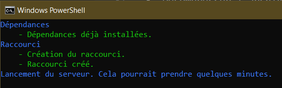

# Notions C#


Site de référence pour le cours de Programmation 1 (1N6) du CÉGEP Édouard-Montpetit développé par les enseignants du département d'informatique.

Ce site de documentation a été construit avec [Docusaurus 2](https://docusaurus.io/). Référez vous à la documentation officielle pour modifier le site.

## Installation

```
$ npm install
```

## Développement Local

```
$ npm start
```

Cette commande démarre une serveur de développement local sur le port `3000` de votre machine personnelle et ouvre un navigateur avec l'adresse locale du site. Les changements effectués sur la documentation (`/docs`) sont automatiquement appliqués sur le site à la sauvegarde des fichiers. Les changements faits à la configuration (ex: `docusaurus.config.js`) nécessitent un redémarrage du projet.

## Déploiement

Tout le code poussé sur la branche `main` de ce dépôt est automatiquement déployée sur [https://info.cegepmontpetit.ca/notions-csharp/](https://info.cegepmontpetit.ca/notions-csharp/) à l'aide de Github Pages et Github Actions.

## Exécution en examen

Puisque les étudiants n'ont pas accès internet pendant un examen, il n'est pas possible de simplement leur dire d'accéder au site web. Pour leur donner accès à notions C#, l'enseignant doit exécuter le site web sur sa machine, et partager l'url aux étudiants.

Pas de soucis, tout est encapsulé dans une commande qui fait tout pour vous.

### 1. Télécharger le site web

1. Accéder au [Github du projet](https://github.com/departement-info-cem/notions-csharp).
2. Télécharger une archive compressée du projet.
3. Décompresser l'archive sur votre machine, dans `C:\EspaceLabo` par exemple.

> Attention, si vous voulez travailler sur le site web, télécharger l'archive du projet n'est pas suffisant. Il faut cloner le projet et faire des commits pour que les changements au code soient accessibles à tous et qu'ils soient déployés.


### 2. Démarrer le serveur

Double cliquez sur le fichier nommé `examen.bat` qui est dans l'archive. Un invite de commande devrait s'ouvrir, et devrait afficher du texte.



L'exécution de cette commande pourrait prendre quelques minutes. Ne fermez jamais cette fenêtre. Si jamais vous la fermez, simplement réexécuter le fichier `examen.bat`.

### 3. Partager le lien aux étudiants

- Une fois que le démarrage est complété, une page web devrait s'ouvrir. L'URL devrait ressembler à quelque chose comme `http://NOM-DE-VOTRE-POSTE/notions-csharp/`.
- Un raccourci nommé Notions C#.url a aussi été généré.
- Partagez le raccourci avec les étudiants, avec NetSchool par exemple.
