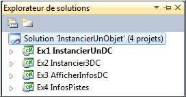
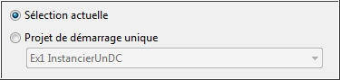

# Projet de démarrage

Une solution peut contenir plusieurs projets. Dans l'explorateur de solutions, le projet de démarrage est en gras.

Pour choisir le projet de démarrage, afficher les propriétés de la solution avec un clic droit sur la solution.
Il existe 2 options.

## Option Sélection actuelle

Le projet sélectionné (celui en gras) est défini comme projet de démarrage.

## Option "Projet de démarrage unique"

Le projet choisi dans la liste est défini comme projet de démarrage.

Il peut être modifié dans l'explorateur de solutions avec un clic droit sur le projet désiré en choisissant

"Définir comme projet de démarrage" dans le menu contextuel.