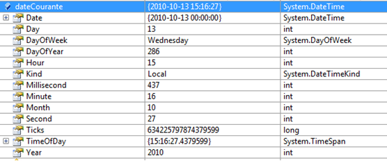

# DateTime

import Exemple2 from './_04-date-time/_exemple-2.md';

Une structure DateTime permet de manipuler des dates et des heures.

| Propriété | Type | Description |
| :-------: | :--: | ----------- |
| Day | `int` | Obtient le jour du mois. |
| DayOfWeek | `DayOfWeek` | Obtient le jour de la semaine sous forme d'un type DayOfWeek. |
| DayOfYear | `int` | Obtient le jour de l'année. |
| Hour | `int` | Obtient l'heure de la date. |
| Minute | `int` | Obtient les minutes de la date. |
| Month | `int` | Obtient le mois de la date. |
| Now | `DateTime` | Obtient un objet DateTime indiquant la date et l'heure actuelles sur cet ordinateur, exprimées en temps local. |
| Second | `int` | Obtient les secondes de la date. |
| TimeOfDay | `TimeSpan` | Obtient l'heure sous la forme d'une structure TimeSpan. |
| Today | `DateTime` | Obtient la date actuelle. |
| Year | `int` | Obtient l'année de la date. |

## Exemple 1 :

Obtenir les propriétés de la date courante

```cs
DateTime dateCourante = DateTime.Now;

int heure = dateCourante.Hour;

int mois = dateCourante.Month;
. . .
```

Voici les valeurs de toutes les propriétés de la variable **dateCourante**:



## Exemple 2 :

| Afficher la date courante sous forme de chaîne | Résultats |
| ---------------------------------------------- | --------- |
| <Exemple2/> | 13 octobre 2013 <br/> <br/> 2013-10-23 <br/> <br/> 15:16:27 <br/> <br/> 15:16 <br/> <br/> Le 13 oct. 2013 <br/> <br/> Le 13 octobre 2013 <br/> <br/> 13:10:2013 15:16:27 |
