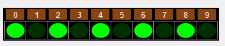

# VisualBoolArray

Un contrôle de type VisualBoolArray est une **grille** dont chaque cellule ne peut contenir que la valeur `true` ou `false`.

Voir les propriétés, les méthodes et les struct communs aux différents types de "VisualArrays" : [BaseGrid](https://sites.google.com/site/notionscsharpcem/gui---visualarrays/basevisualarray)

| Propriété | Type | Description |
| :-------: | :--: | ----------- |
|  <br/> (Name) | | Indique le nom utilisé dans le code pour identifier l’objet. Préfixe : `vba` Exemple : `vbaMaxErreurs` |
|  <br/> DefaultValue | `bool` | Obtient ou définit la valeur par défaut des cellules. La valeur par défaut est `false`. |
|  <br/> SelectedIndex | `int` | Obtient ou définit l'index de la cellule sélectionnée en tenant compte du mode d'adressage. Si aucune cellule n'est sélectionnée, alors la valeur de l'index est **-1**. |
|  <br/> SpecialValue | `bool` | Obtient ou définit une valeur spéciale à afficher différemment des autres valeurs. La valeur spéciale est `true`. |
|  <br/> SpecialValueAppearance | | Détermine différents aspects de l'apparence de la valeur spéciale. |

| Méthode | Description |
| :-----: | ----------- |
|  <br/> MixUp() | Mélange aléatoirement les cellules en les permutant plusieurs fois, soit le nombre de cellules * 2. |
|  <br/> MixUp(int pSwapCount) | Mélange aléatoirement les cellules en les permutant le nombre de fois spécifié. |
|  <br/> Swap(int pIndex1, int pIndex2) | Échange les 2 cellules aux index spécifiés. |

Exemple : Ayant une grille de booléens `vbaGrille` à 1 rangée et 10 colonnes,on veut allumer les cellules dont l'index est pair. L'apparence de la valeur spéciale a été modifiée afin de visualiser un ovale vert lumineux ou mat.



```cs
vbaGrille.Clear();
for (int index = 0; index < vbaGrille.Length; index += 2)
{
    vbaGrille[index] = true;
}
```
