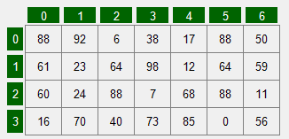

# VisualIntArray

Un contrôle de type VisualIntArray est une **grille** dont les cellules contiennent des nombres entiers.

Voir les propriétés, méthodes et struct communs aux différents types de "VisualArrays" : [BaseGrid](https://info.cegepmontpetit.ca/notions-csharp/visual-arrays/base-grid)

| Propriété | Type | Description |
| :-------: | :--: | ----------- |
|  <br/> (Name) | | Indique le nom utilisé dans le code pour identifier l’objet. Préfixe: `via` Exemple: `viaNombres` |
|  <br/> DefaultValue | `int` | Obtient ou définit la valeur par défaut des cellules. La valeur par défaut est 0. |
|  <br/> SpecialValue | `int` | Obtient ou définit la valeur spéciale à afficher différemment des autres valeurs. |
|  <br/> SpecialValueAppearance |  | Détermine les différents aspects de l'apparence de la valeur spéciale. |
|  <br/> View | | Obtient ou définit le style de visualisation des cellules: <br/> - Number : les nombres <br/> - Graph : les nombres sous la forme d'un graphique en barres <br/> - Digit : un nombre selon la représentation binaire du nombre à partir de 7 segments <br/> - ImageList : selon l'index des images dans une ImageList. La propriété EnabledAppearance.  ImageList permet de définir la liste d'images. Si lacellule contient la valeur 2, alors l'imageà l'index 2de la liste est affichée. <br/> - GraphNumber : le nombre et son graphique en barres. |
|  <br/> Maximum | int | Obtient ou définit la valeur maximale de toutes les cellules. |
|  <br/> Minimum | int | Obtient ou définit la valeur minimale de toutes les cellules. |


| Méthode | Description |
| :-----: | ----------- |
|  <br/> MixUp() | Mélange aléatoirement les cellules en les permutant plusieurs fois, soit le nombre de cellules * 2. |
|  <br/> MixUp(int pSwapCount) | Mélange aléatoirement les cellules en les permutant le nombre de fois spécifié. |
|  <br/> Swap(int pIndex1, int pIndex2) | Échange les 2 cellules aux index spécifiés. |
|  <br/> RandomAddress() | Génère aléatoirement une adresse. |
|  <br/> RandomDirection() | Génère aléatoirement une direction. |
|  <br/> RandomDirection(enuDirection  pCurrentDirection) | Génère aléatoirement une direction différente de celle spécifiée. |
|  <br/> RandomIndex() | Génère aléatoirement un nombre entier entre 0 et le nombre de colonnes -1 de la grille. |
|  <br/> RandomValue() | Génère aléatoirement un nombre entier entre les limites minimale et maximale de la grille. |
|  <br/> RandomValue(int pMin, in pMax) | Génère aléatoirement un nombre entier entre le minimum et le maximum spécifiés. |

| Événement | Description |
| :-------: | ----------- |
|  <br/> SelectedIndexChanged | Se produit lorsque la valeur de la propriété SelectedIndex est modifiée. |

Exemple : Ayant une grille d'entiers viaNombres à 4 rangées et 7 colonnes, on veut remplir la grille de nombres généré au hasard.



```cs
for (int rangée = 0; rangée < viaNombres.RowCount; rangée++)
{
    for (int colonne = 0; colonne < viaNombres.ColumnCount; colonne++)
    {
        viaNombres[rangée , colonne] = viaNombres.RandomValue();
    }
}
```
