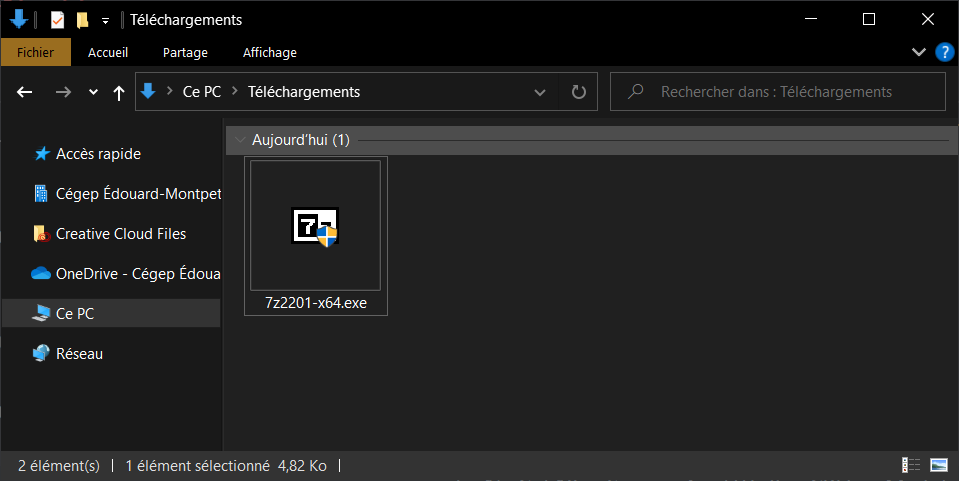
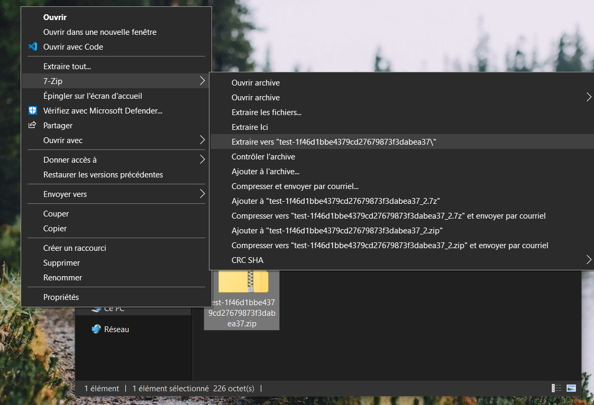

# 7zip

7-Zip permet entre autres de compresser un **répertoire** (dossier) en un fichier que l'on appelle **archive** ainsi que de décompresser une **archive** vers un **répertoire**.

## Utilisation

Il est important de compresser nos fichiers avant de les déplacer ou de les enregistrer sur OneDrive afin d'éviter la perte d'informations. Vous ne devriez **jamais** travailler directement sur OneDrive. Le logiciel OneDrive n'est pas conçu pour la programmation et peut causer des erreurs de synchronicité.

Quand vous avez terminé de travailler, vous devez compresser votre projet dans un fichier `.zip` et le déposer sur OneDrive. Quand vous continuez un projet, vous devez récupérer le fichier `.zip` sur votre ordinateur local et le décompresser. Lorsque vous avez fini de travailler, vous pouvez le compresser à nouveau et le déposer sur votre OneDrive.

## Télécharger l'installateur

Naviguez sur la page des téléchargements de [7-Zip](https://www.7-zip.org/download.html) et cliquez sur le premier bouton "**Download**" qui est vis-à-vis **Type** `.exe` et **System** `64-bit Windows x64`. Enregistrez le fichier à un endroit familier sur votre ordinateur.

## Installer 7-Zip

Double cliquez sur l'installateur téléchargé à la précédente étape. Acceptez de donner les permissions qui vous sont demandées.

Cliquez sur le bouton "**Install**".

Une fois l'installation complétée. Cliquez sur le bouton "**Close**".

## Vérification

Téléchargez le fichier **[suivant](@site/static/file/test.zip)**.

- Effectuez un clic droit sur le fichier téléchargé.
- Vous devriez apercevoir une option nommée "**7-Zip**".
- Cliquez dessus.
- Cliquez sur l'option "**Extraire vers "test-[...]"**".

Un nouveau répertoire nommé "**test-[...]**" devrait être apparu à côté du fichier téléchargé.

Ouvrez ce répertoire, puis ouvrez le fichier nommé "**Fichier test.txt**". Vous devriez voir le message "**Votre installation de 7zip est fonctionnelle. Félicitation!**"

:::caution Attention!

Si l'une des étapes suivantes n'a pas fonctionné pour vous ou que vous n'arrivez pas au même résultat final, assurez-vous de contacter votre enseignant rapidement pour qu'il puisse vous aider.

:::
