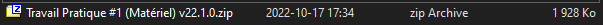
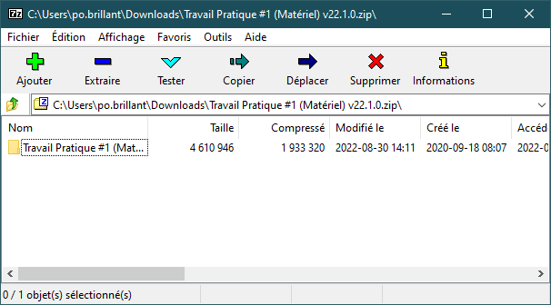
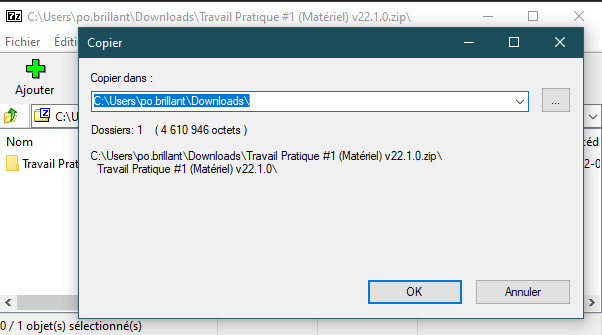
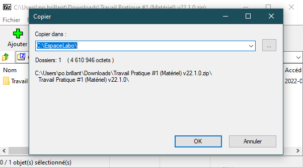
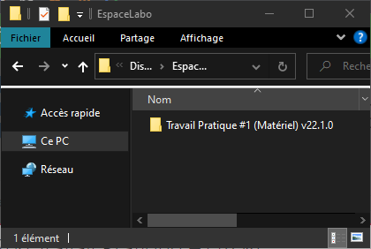
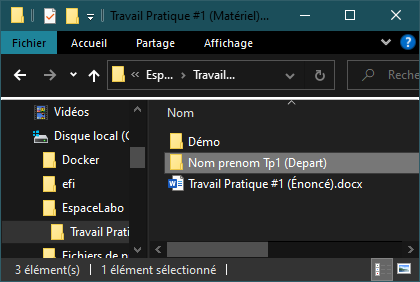
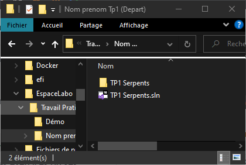

# Travailler sur du matériel

Tout le matériel fournit par le CÉGEP est compressé au format zip. Pour être en mesure de travailler sur le matériel, il faudra donc les décompresser et les placer dans un répertoire adéquat.

:::info Travailler à la maison

Si vous travaillez de la maison, n'oubliez pas d'installer les logiciels nécessaires pour le cours. Des guides d'installation sont disponibles dans [cette section](./installation-des-logiciels).

:::

Une fois le matériel téléchargé, double-cliquez sur l'archive. Si 7zip est correctement installé sur votre poste, il devrait s'ouvrir.

Cliquez sur le bouton "**Extraire**".

En cliquant sur les "**...**", on vous demande de sélectionner un dossier ou extraire l'archive. Si vous êtes au CÉGEP, choisissez `C:\EspaceLabo\`. Si vous êtes à la maison, choisissez un emplacement qui vous convient. Cliquez sur "**Ok**".

Dans un Explorateur Windows, naviguez à l'emplacement où vous venez d'extraire le matériel. Vous devriez voir un répertoire qui porte un nom similaire à l'archive du matériel téléchargé.

En ouvrant le répertoire qui contient le matériel, vous devriez voir au moins 2 répertoires :

- `Démo` : Contient un fichier exécutable (`.exe`) de démonstration. Votre objectif sera de faire en sorte que votre programme ait le même comportement que l'exécutable.
- `Nom prenom X` : Répertoire qui contient le projet de départ. Le projet de départ contient du code source que vous devrez compléter.
- `X.docx` ou autre : Énoncé détaillé du travail à compléter. Habituellement remis avec les travaux pratiques.

:::caution Attention

Vous devez toujours renommer le répertoire `Nom prenom X` pour votre nom et votre prénom. Ex : `Brillant PierreOlivier X`.

:::

Ouvrez le répertoire `Nom prenom X` que vous venez tout juste de renommer.

En double-cliquant sur le fichier qui se termine par `.sln` (celui qui a l'icône de Visual Studio), Visual Studio devrait s'ouvrir.

:::danger Attention

Ne modifiez jamais le répertoire ou son contenu. Il contient le code source, et des manipulations hasardeuses pourraient rendre votre projet inutilisable.

:::
