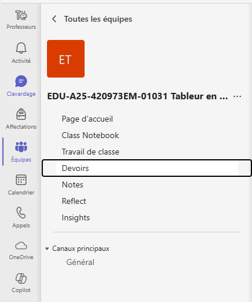
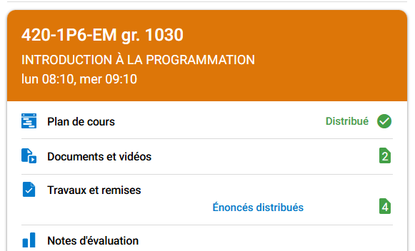

# Remettre du matériel

## Renommer dans Visual Studio

Si ce n'est pas déjà fait, avant de fermer Visual Studio, assurez vous d'avoir renommé la variable `APP_INFO` avec votre nom et prénom.

```cs
public const string APP_INFO = " (Matériel)";
```

devient

```cs
public const string APP_INFO = " (Brillant PierreOlivier)";
```

:::tip Truc

Si vous ne trouvez pas la variable, vous pouvez ouvrir la recherche avec `Ctrl+f` et chercher `APP_INFO`.

:::

:::caution Attention!

Vous pourriez éventuellement perdre des points pour les travaux pratiques si ce n'est pas effectué.

:::

## Renommer les fichiers

- Fermez Visual Studio.
- Si ce n'est pas déjà fait, renommez le répertoire qui se nomme "**Nom prenom [...] (Départ)**" pour votre nom et votre prénom et en retirant le "**(Départ)**".


:::caution Attention!

Vous pourriez éventuellement perdre des points pour les travaux pratiques si ce n'est pas effectué.

:::

## Compresser le répertoire

Compressez le répertoire nommé "**Nom prenom [...]**" à l'aide de 7-zip.


## Effectuer une remise

Selon les instructions de remise de votre professeur, vous devez déposer votre travail soit sur Teams, Léa, ou Moodle.


### Sur Teams
Sur Teams, allez dans l'équipe de votre cours et sélectionnez la section **Devoirs** dans le menu de gauche.



Dans la section **À venir** ou **En retards**, vous devez sélectionner le devoir correspondant.

Appuyez sur le bouton **Joindre** et sélectionnez le fichier .zip contenant votre devoir.


Le travail devrait maintenant apparaitre dans la section **Devoirs** avec un petit crochet vert et le mot *Remis*.


### Sur LÉA
Sur Omnivox, dans LÉA, naviguez vers la section **Travaux et remises** de votre cours.



Sélectionnez le devoir correspondant.


Dans la fenêtre de remise, appuyez sur le bouton **CHOISIR** puis sélectionnez le fichier zip contenant votre travail.

Vous devez ensuite appuyer sur **TRANSMETTRE** pour compléter la remise.


### Sur Moodle
Sur Moodle, naviguez vers la page de remise du travail que vous souhaitez remettre.


- Glissez votre archive dans la zone de remise.
- Cliquez sur le bouton "**Enregistrer**".


Assurez vous de voir la confirmation de votre remise. Vous devriez aussi recevoir un courriel vous confirmant que votre travail a bien été remis.


