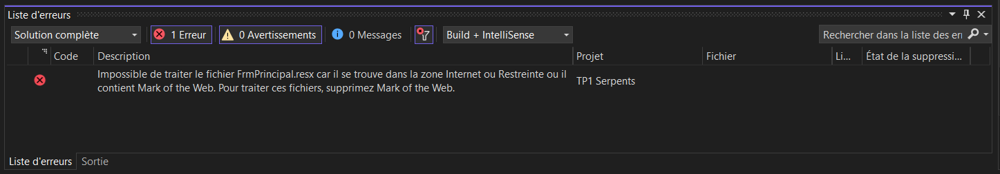
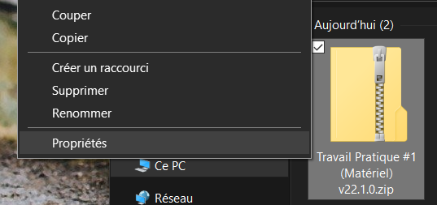
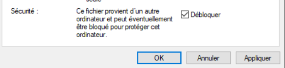

# Mark of the Web

## Problème

Lors de la première exécution d'un projet, il est possible que le message d'erreur suivant s'affiche.

```
Impossible de traiter le fichier FrmPrincipal.resx car il se trouve dans la zone Internet ou Restreinte ou il contient Mark of the Web. Pour traiter ces fichiers, supprimez Mark of the Web.
```



## Solution

- Fermez Visual Studio.
- Supprimer le dossier qui contient la matériel sur lequel vous tentez de travailler. Vous pouvez aussi le supprimer plus tard.
- Retrouvez l'archive du matériel sur lequel vous tentez de travailler.
- Effectuez un clic droit sur l'archive, puis sélectionnez l'item "**Propriétés**".



Cochez la case "**Débloquer**".



Extrayez l'archive comme vous l'avez fait précédement. Votre projet devrait maintenant s'exécuter correctement.

:::caution Attention!

Si le problème persiste, assurez vous de contacter votre enseignant rapidement pour qu'il puisse vous aider.

:::

## Explication

La plupart des navigateurs modernes ajoutent une information cachée dans votre archive téléchargée qui indique au système d'exploitation que le fichier projet de l'internet. 

Cette marque indique aux divers programmes qui pourraient exécuter ce qui se trouve dans cette archive que le fichier provient d'internet, et donc potentiellement malicieux. 

En effectuant la manipulation décrite dans l'étape [Solution](#solution), nous indiquons à notre système d'exploitation que l'archive en question peut être considérée comme sécuritaire.

:::danger Danger!

Il est acceptable de débloquer l'archive puisque nous travaillons dans un contexte ou nous connaissons la provenance de l'archive : le CÉGEP. Or, si le fichier provient d'un site web peu fiable, pensez y à deux fois avant de débloquer une archive.

:::
