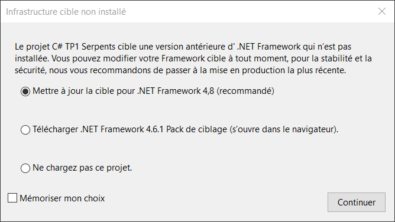

# Infrastructure cible non installé

## Problème

À l'ouverture d'un projet vous êtes accueillis d'une fenêtre vous indiquant le message suivant : 

```
Le projet C# x cible une version antérieur d'.NET Framework qui n'est pas installée. Vous pouvez modifier votre Framework cible à tout moment, pour la stabilité et la sécurité, nous vous recommandons de passer à la mise en production la plus récente.
```



## Solution

- Sélectionnez l'option recommandé.
- Cliquez sur le bouton "**Continuer**".

:::info

Si le programme a un comportement innatendu lors de son exécution (Ex : l'interface n'est pas à l'échelle), avisez votre enseignant du problème.s

:::

## Explication

Chaque projet C# utilisé dans le cours est associé à une version du quadriciel .NET lors de sa création. Après un certains temps, le quadriciel .NET qui est associé avec le projet tombe en fin de vie et cesse de recevoir du support de la part de Microsoft. Afin de continuer à utiliser un projet qui n'est pas à jour avec la dernière version du quadriciel .NET, il faut mettre à jour la version associée au projet, comme nous avons fait dans la section **[Solution](#solution)**.
