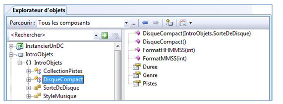

# Instanciation objet

## Notion de Classe

Les objets sont créés à partir d'une classe. Une classe est un modèle qui définit les caractéristiques d'un objet : les variables membre, les méthodes et les propriétés qui pourront être utilisées par l'objet.

Par exemple, les contrôles `txtNom` et `txtCout` sont des objets de la classe `TextBox`. Cette classe définit toutes les propriétés et les méthodes que l'on peut utiliser avec de tels objets : `txtNom.Text`, `txtCout.Text`, `txtNom.Enabled`, `txtCout.Enabled`, `txtNom.Clear()`, `txtCout.Clear()`, etc.

Pour pouvoir utiliser un objet, il faut d'abord l'instancier (le créer).

Un objet est souvent désigné avec le terme d'**instance** de la classe.

## Constructeur et opérateur new

On retrouve dans une classe, des méthodes spéciales appelées **constructeurs** qui permettent d'**instancier** un objet.
Un constructeur permet de créer une instance de la classe, en donnant une valeur initiale à toutes ses variables membre.
L'objet est créé dans un certain état.

- Le constructeur est une méthode qui porte le ***même nom que la classe*** mais qui ***n’a pas de type***. 
- Le constructeur est exécuté lorsqu'un objet est créé à l'aide de l’opérateur `new`.

Par exemples :

- En mode "conception", le concepteur instancie les contrôles qui ont été déposés sur le formulaire.  Si le formulaire contient 2 boîtes de texte `txtNom` et `txtCout`, le code généré par le concepteur contiendra les instructions pour les instancier.

```cs
TextBox txtNom;
TextBox txtCout;
. . .
txtNom = new TextBox();
txtCout = new TextBox();
```

- Pour lire un fichier texte, il faudra d'abord instancier un objet de type `StreamReader`.

```cs
StreamReader objFichierALire = new StreamReader("donnees.txt");
. . .
string uneLigne = objFichierAlire.ReadLine();
```

## La classe DisqueCompact de la librairie "IntroObjets"

La classe `DisqueCompact` simule un disque compact qui se caractérise par le genre de musique, la durée totale du disque en secondes et une collection de pistes contenant la durée en secondes de chacune des pistes.

La classe `DisqueCompact` est contenue dans une bibliothèque logicielle DLL (Dynamic Link Library) nommée `IntroObjets`. Pour utiliser cette librairie, il faut :

- dans l'explorateur de solutions, ajouter la référence vers le fichier `IntroObjets.dll`;
- au début du code du formulaire principal,  ajouter l'instruction `using IntroObjets`;

La bibliothèque peut être visualisée grâce à l'explorateur d'objets de VisualStudio. Seules les méthodes publiques de la classe sont affichées.



| Propriété | Type | Description |
| :-------: | :--: | ----------- |
| Duree | `int` | Obtient la durée totale des pistes du disque en secondes. <br/> Exemple : `int dureeDisque = objDisqueCourant.Duree` |
| Genre | `StyleMusique` | Obtient le genre de musique du disque. <br/> Les styles de musique sont définis par l'énumération `StyleMusique` : <br/> Classique, Country, Danse, Jazz, Pop, Rap et Rock.
| Pistes | `Collection` | Obtient un objet représentant la collection des items "Pistes" contenus dans un disque.
         Chaque item est un entier représentant la durée en secondes d'une piste.
         Pour accéder à un item particulier de cette collection, un index est utilisé.
         Exemple : int dureePisteIndexTrois = objDisqueCourant.Pistes[3];
 
  Pistes.Count	 int	 Obtient le nombre d'items "pistes" de la collection Pistes du disque.
        Exemple : int cptPistes = objDisqueCourant.Pistes.Count;

 Constructeur	 Description
 DisqueCompact()

 Instancie un objet de type DisqueCompact où toutes les valeurs des propriétés sont
 assignées aléatoirement : le nombre de pistes, leur durée et le genre de musique.
    Exemple :   DisqueCompact objDC1 = new DisqueCompact();
 DisqueCompact(IntroObjets.SorteDeDisque)
 
 Instancie un objet de type  DisqueCompact dont la sorte de disque est indiquée en
 paramètre.

 Les sortes de disques sont définies par l'énumération SorteDeDisque :
 Normal : le nombre de pistes, les durées des pistes et le genre sont aléatoires.
   Exemple : DisqueCompact objDC2 = new DisqueCompact(SorteDeDisque.Normal);
 Test1  : Un disque à 2 pistes : la 1ère piste de 59 secondes et la 2e de
             5 minutes 1 seconde pour une durée totale de 360 secondes (6 minutes).
             Le genre est aléatoire.

 Test2 : Un disque à 8 pistes de 5 minutes, pour une durée totale de 
            2400 secondes (40 minutes). Le genre est aléatoire.

 Test3 : Un disque à 12 pistes d'une durée totale de 2880 secondes (48 minutes).
            La durée des pistes alterne entre 3:59 et 4.01. Le genre est aléatoire.

 Méthode statique
 Description
 FormatHHMMSS(int pDuree)
 Retourne une durée en secondes dans une chaîne selon le format "HH:MM:SS".
         Exemple : DisqueCompact.FormatHHMMSS(objDisque.Duree)
 FormatMMSS(int pDuree)
 Retourne une durée en secondes dans une chaîne selon le format "MM:SS".
         Exemple : DisqueCompact.FormatMMSS(objDisque.Duree)

Exemple #1 : Instancier un disque normal et afficher les informations sur le disque.
 Résultats
DisqueCompact objDisque = new DisqueCompact();

Console.WriteLine("Nombre de pistes: " + objDisque.Pistes.Count.ToString());
Console.WriteLine("Durée totale: " + objDisque.Duree.ToString() + "secondes");
Console.WriteLine("Durée (MM:SS): " + DisqueCompact.FormatMMSS(objDisque.Duree));
Console.WriteLine("Genre: " + objDisque.Genre.ToString());	 

  Nombre de pistes: 10
  Durée totale : 3910 secondes
  Durée (MM:SS): 65:10
  Genre: Jazz

Exemple #2 : Instancier un disque Test3 et afficher la durée de chacune des pistes du disque.
 Résultats
DisqueCompact objDisque = new DisqueCompact(SorteDeDisque.Test3);

for (int index = 0; index < objDisque.Pistes.Count; index++)
{
    int dureePiste = objDisque.Pistes[index];
    Console.WriteLine("Piste " + (index + 1) + "-" + DisqueCompact.FormatMMSS(dureePiste));
}	 
  Piste 1 - 3:59
  Piste 2 - 4:01
  Piste 3 - 3:59
  Piste 4 - 4:01
  Piste 5 - 3:59
  Piste 6 - 4:01
  Piste 7 - 3:59
  Piste 8 - 4:01
  Piste 9 - 3:59
  Piste 10 - 4:01
  Piste 11 - 3:59
  Piste 12 - 4:01
