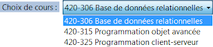

# ComboBox

Un contrôle ComboBox est l'association d'un contrôle ListBox et d'un contrôle TextBox. Il est possible de choisir un élément dans la liste ou saisir du texte. La propriété DropDownStyle définit le mode de fonctionnement du contrôle.

Exemple :  Liste avec la propriété DropDownStyle définie à DropDownList.

La zone de liste déroulante est souvent utilisée avec :

- un `switch...case` selon la propriété `SelectedIndex`
- l'événement `SelectedIndexChanged` au changement de choix dans la liste.

| Propriété | Type | Description |
| :-------: | :--: | ----------- |
|  (Name) | | Indique le nom utilisé dans le code pour identifier l’objet. Préfixe : `cbo`, par exemple : `cboSortesEcran` |
|  Enabled | `bool` | Obtient ou définit true ou false si le contrôle est activé ou non. |
|  Visible | `bool` | Obtient ou définit true ou false si le contrôle est visible ou masqué. |
|  Text | `string` | Obtient le texte qui est sélectionné dans la liste. |
|  DropDownStyle | | Contrôle l'apparence et la fonctionnalité du contrôle.   - Simple : la liste est affichée en permanence   - DropDown : la liste est affichée à un clic sur la flèche noire   - DropDownList : il est impossible de saisir du texte dans la liste |
|  Items | `(Collection)` | Les éléments contenus dans la zone de liste déroulante. |
|  SelectedIndex | `int` | Obtient ou définit l'index spécifiant l'élément actuellement sélectionné. Les items sont numérotés à partir de 0. Si l'index est **-1**, alors aucun item n'est sélectionné. Exemples :   Pour sélectionner l'item à l'index 3 : `cboProduits.SelectedIndex = 3;`   Pour enlever la sélection : `cboProduits.SelectedIndex = -1;` |

| Événement | Description |
| :-------: | ----------- |
|  SelectedIndexChanged | Se produit chaque fois que la propriété SelectedIndex est modifiée. |
