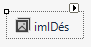
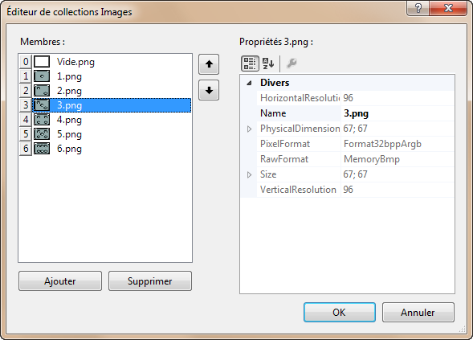

# ImageList

Le composant ImageList gère une collection d'images qui sont généralement utilisées par d'autres contrôles, tel un contrôle VisualCells. L'imageList est représenté par l'icône ci-dessus qui se trouve au bas de la fenêtre de conception. La flèche noire affiche l'éditeur de la collection d'images. Chaque image est associée à un index, un entier numéroté à partir de 0.

| Propriété | Type | Description |
| :-------: | :--: | ----------- |
|  (Name) | | Nom utilisé dans le code pour identifier l’objet. Préfixe : `iml` Exemple : `imlDes` |
|  Images | (`Collection`) | Contient les images stockées dans la liste. |

L'éditeur de collections Images permet de gérer les images contenues dans la collection.

