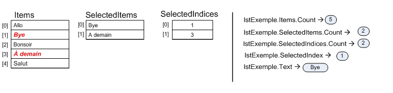

# Collections

Il existe 3 collections associées à une zone de liste:

- **Items** : les items de la liste.
- **SelectedItems** : les items sélectionnés.
- **SelectedIndices** : les index (indices) des items sélectionnés.

Voici un exemple, illustrant le lien entre les 3 collections associées à la zone de liste lstExemple.

Les items en **rouge** sont sélectionnés.
