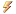

# Timer

import Start from './_13-timer/_start.md';
import Stop from './_13-timer/_stop.md';

Un composant Timer permet d'implémenter une minuterie déclenchant un événement selon un intervalle de temps défini par l'utilisateur.

| Propriété | Type | Description |
| :-------: | :--: | ----------- |
|    (Name) | | Indique le nom utilisé dans le code pour identifier l’objet. Préfixe : `tmr` Exemple : `tmrHorloge`
|    Enabled | `bool` | Obtient ou définit l'état de la minuterie, soit active ou non. `true` si la minuterie est active ; sinon, `false`. L'état par défaut est `false`. |
|    Interval | `int` | Obtient ou définit la fréquence de temps en millisecondes du déclenchement de l'événement Tick |

| Événement | Description |
| :-------: | ----------- |
|    Tick | Se produit lorsque l'intervalle de temps spécifié s'est écoulé. |

| Méthodes | Description |
| :------: | ----------- |
|    Start | Démarre la minuterie. Exemple : <Start/> |
|    Stop | Arrête la minuterie. Exemple : <Stop/> |
