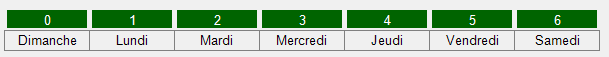

# VisualStringArray

Un contrôle de type VisualStringArray est une **grille** dont les cellules contiennent une chaîne de caractères.

| Propriété | Type | Description |
| :-------: | :--: | ----------- |
|  <br/> (Name) | | Indique le nom utilisé dans le code pour identifier l’objet. Préfixe: `vsa` vsaNomJoueurs |
|  <br/> DefaultValue | `string` | Obtient ou définit la valeur par défaut des cellules. |
|  <br/> SelectionMode | | Indique le mode de sélection des cellules de la grille : <br/> - None : aucune sélection <br/> - One : sélection d'une seule cellule. <br/> - MultiSimple (ctrl ) et MultiExtended (shift, ctrl): sélection de plusieurs cellules. |
|  <br/> SpecialValue | `string` | Obtient ou définit la valeur spéciale à afficher différemment des autres valeurs. |
|  <br/> SpecialValueAppearance | | Détermine les différents aspects de l'apparence de la valeur spéciale. |
|  <br/> SelectedValue | `string` | Obtient la valeur de la cellule sélectionnée. |
|  <br/> Value | `string` | Obtient ou définit la valeur de la première cellule. |
|  <br/> View | | Obtient ou définit le style de visualisation des cellules : <br/> - Text : affichage de la chaine <br/> - ImageFile : affichage de l'image correspondant au nom de fichier contenu dans la cellule Les images sont contenus dans le fichier bin/Debug. Si les images sont dans le répertoire images, la chaine doit contenir le nom répertoire/ suivi du nom de fichier suivi de l'extension du fichier. Exemple : "images/pomme.png" |

| Méthode | Description |
| :-----: | ----------- |
|  <br/> MixUp() | Mélange aléatoirement les cellules en les permutant plusieurs fois, soit le nombre de cellules * 2. |
|  <br/> MixUp(int pSwapCount) | Mélange aléatoirement les cellules en les permutant le nombre de fois spécifié. |
|  <br/> Swap(int pIndex1, int pIndex2) | Échange les 2 cellules aux index spécifiés. |

Exemple : Remplir une grille `vsaJours` à une rangée et 7 colonnes à partir d'un tableau.



```cs
string [] tabJours = {"Dimanche", "Lundi", "Mardi", "Mercredi", "Jeudi", "Vendredi", "Samedi"};

for (int index = 0; index < tabJours.Length; index++)
{
    vsaJours[index] = tabJours[index];
}
```
