# Visual Studio

Visual Studio est l'EDI (**E**nvironnement de **D**éveloppement **I**ntégré) qui est utilisé dans le cours. Vous utiliserez cet outil pour travailler sur vos travaux pratiques ainsi que les exercices sur cours.

## Prérequis

- Accès à votre compte Microsoft du CÉGEP.
- Un ordinateur ayant une architecture x64 qui exécute Windows 10 ou plus.
- Environs 45 minutes de votre temps.

:::info

L'identifiant du compte Microsoft du CÉGEP ressemble à `matricule@cegepmontpetit.ca` où `matricule` est votre code à 7 chiffre que vous utilisez aussi pour vous connecter à Omnivox.

:::

## Activer la license étudiante

Naviguez vers les page d'activation de la license étudiante de **[Microsoft Azure](https://azure.microsoft.com/fr-ca/free/students/)** et cliquez sur démarrer.

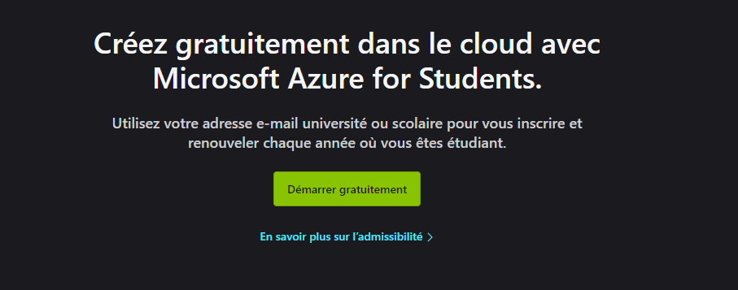

Cliquez sur le bouton **Démarrer gratuitement** et complétez les étapes demandées. Il est possible qu'un numéro de téléphone vous soit demandé.

## Télécharger l'installateur

Naviguez vers le portail **[Microsoft Azure](https://portal.azure.com/#blade/Microsoft_Azure_Education/EducationMenuBlade/software)**. Vous devriez voir plus de 10 logiciels listés. Si ce n'est pas le cas, assurez vous d'avoir bien complété l'étape précédente.

Dans la barre de recherche, entrez "**Visual Studio Enterprise Edition 2022**", puis appuyez sur la touche `Entrer` sur votre clavier.

Sélectionnez "**Visual Studio Enterprise Edition 2022**". Une barre latérale à droite de votre écran devrait s'ouvrir.

Cliquez sur le bouton "**Télécharger**" au bas de la page. Enregistrez le fichier à un endroit familier sur votre ordinateur. Gardez cette page web ouverte, vous devrez y revenir plus tard.

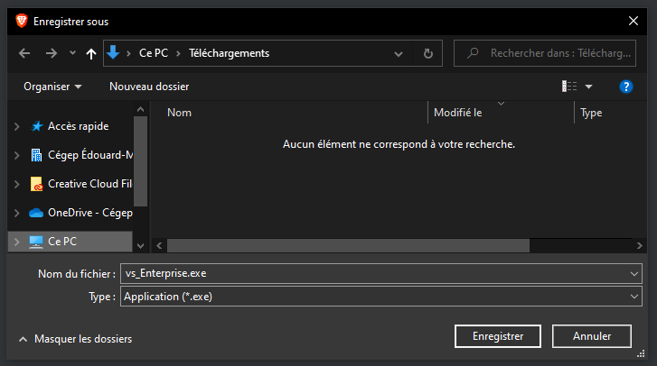

## Installer Visual Studio et sélectionner les configurations

Double cliquez sur l'installateur téléchargé à la précédente étape. Acceptez de donner les permissions qui vous sont demandées.

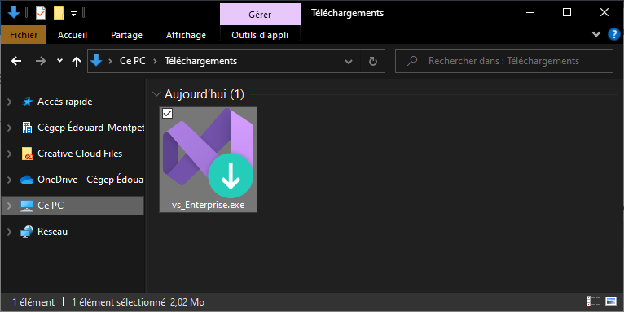

Cliquez sur le bouton "**Continuer**" et attendez que l'installateur se télécharge. Le temps de téléchargement va varier selon la vitesse de votre connexion internet.

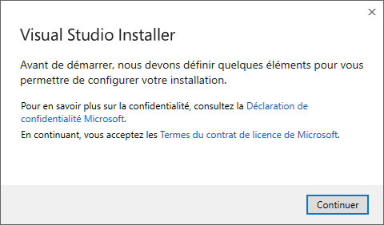

La fenêtre suivante devrait s'afficher après quelques minutes.

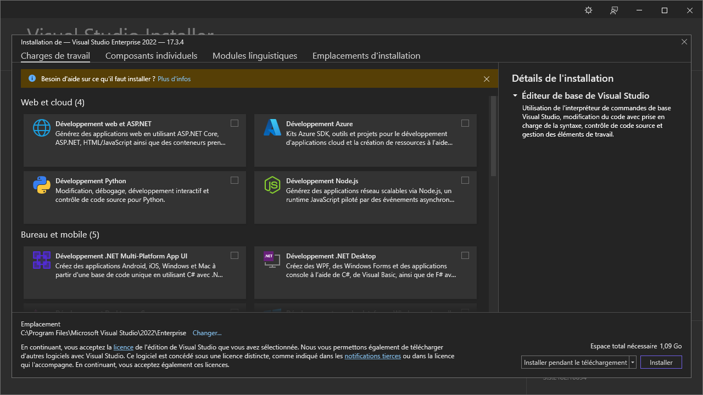

Sélectionnez les options suivante :

- Développement .NET Desktop 
- Développement web et ASP.NET

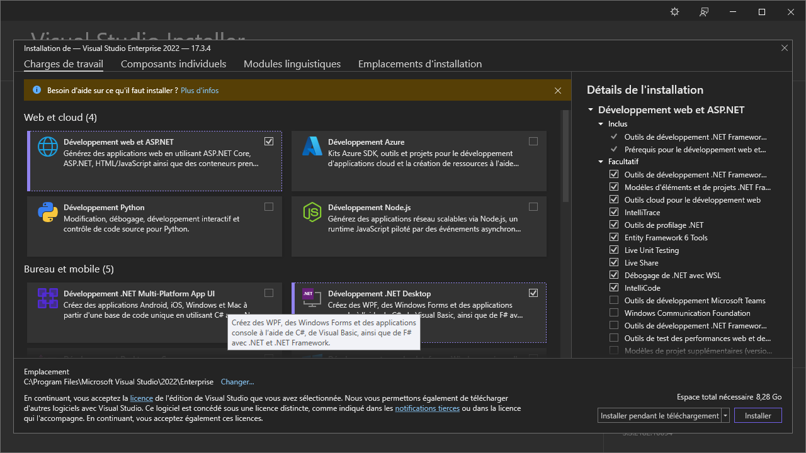

Cliquez sur le bouton "**Installer**". La taille de l'installation pourrait légèrement varier de votre côté.

Le téléchargement et l'installation sont lancés. Patientez quelques minutes. La vitesse de téléchargement et d'installation vont varier selon la vitesse de votre connexion internet et la configuration de votre ordinateur.

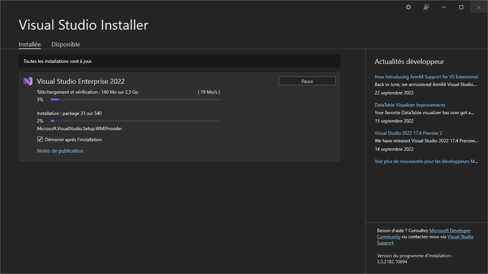

Une fois l'installation terminée, la fenêtre suivante devrait s'ouvrir.

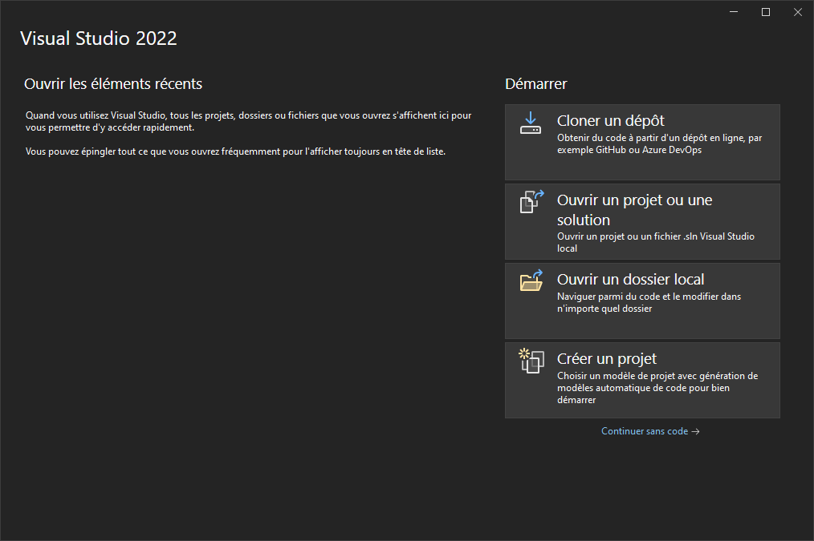

Gardez cette fenêtre ouverte pour la prochaine étape.

## Enregistrer la license

Si Visual Studio n'est pas déjà ouvert, vous pouvez l'ouvrir en cherchant "**Visual Studio 2022**" dans votre barre de recherche Windows.

Cliquez sur le bouton "**Continuer sans code**" qui est en bas à droit de la fenêtre. Visual Studio devrait s'ouvrir avec une interface plus ou moins similaire à celle-ci.

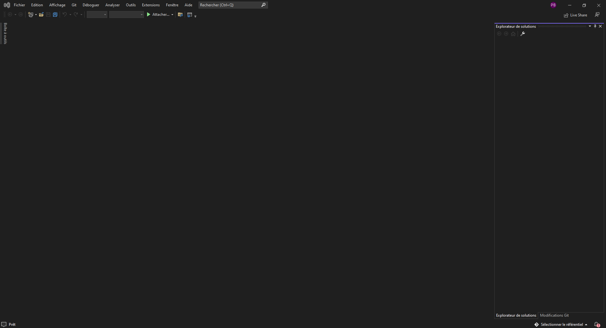

Cliquez sur le bouton "**Connexion**" situé en haut à droite de l'écran et connectez vous à votre compte Microsoft du CÉGEP.

Une fois la dernière étape complétée, vous devriez voir vos initiales s'afficher où le bouton de connexion était. Cliquez sur vos initiales.

Puis sur le bouton "**Paramètres du compte...**".

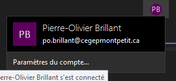

Cliquez sur le bouton d'activation de la license.

Sur internet, retournez sur le portail Azure où vous avez téléchargé l'installateur. Si vous n'êtes plus sur la page, refaites une partie des étapes de la section **[Télécharger l'installateur](#télécharger-linstallateur)**.

Cliquez sur le bouton "**Afficher la clé**", puis cliquez sur le bouton "**Copier dans le Presse-Papier**".

De retour sur Visual Studio, collez la clé qui est dans votre Presse-Papier. Votre license de Visual Studio est maintenant activée.

## Vérifier son installation

Afin de vérifier que Visual Studio s'est bien installé, nous allons exécuter un projet de test très simple.

Visual Studio 2022 devrait maintenant s'afficher dans la liste de vos programmes. Lancez le.

Cliquez sur le bouton "**Créer un projet**".

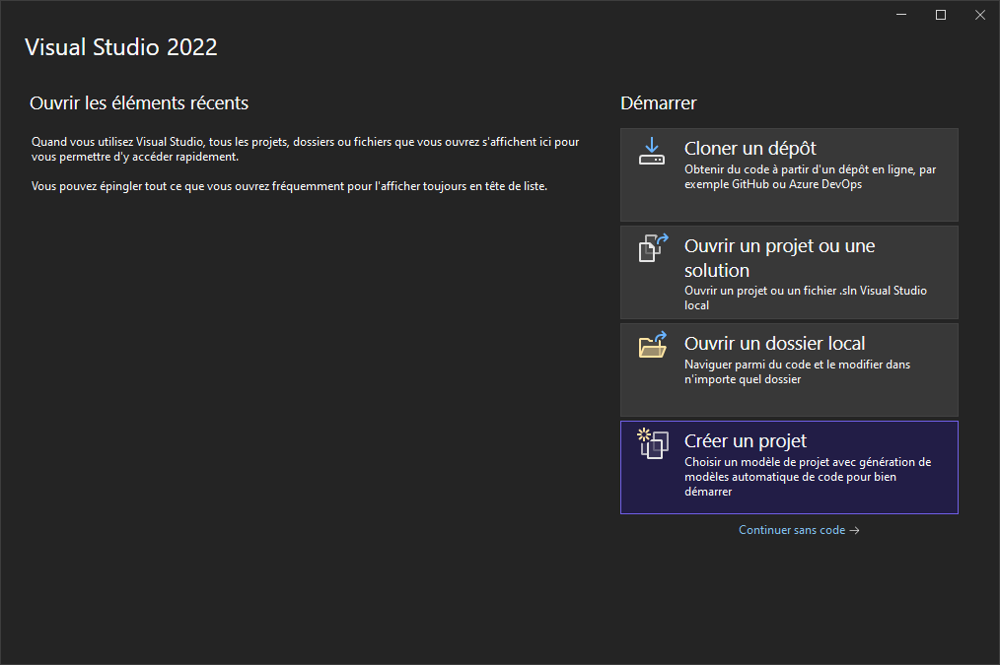

Dans la barre de recherche, recherchez "**Console**", sélectionnez le résultat "**Application console**" qui possède les tags "**C#**", "**Linux**", "**macOS**", "**Windows**", "**Console**", puis cliquez sur le bouton "**Suivant**" situé en bas à droite de la fenêtre.

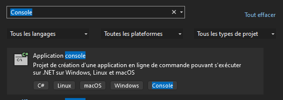

Nous n'allons pas modifier ces configuration cette fois ci. Cliquez sur le bouton "**Suivante**" situé en bas à droite de la fenêtre.

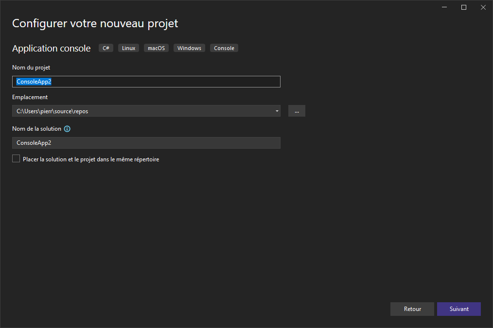

Cochez l'option "**N'utilisez pas d'instructions de niveau supérieur**" et cliquez sur le bouton "**Créer**" situé en bas à droite de la fenêtre.

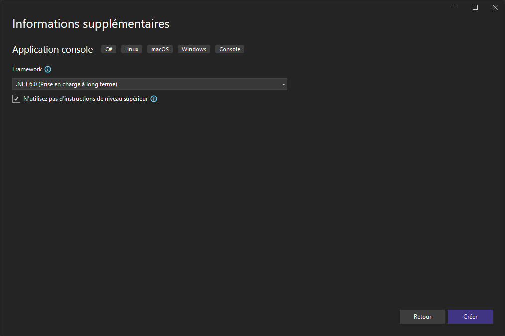

Après quelques instants, une fenêtre similaire à celle ci devrait s'ouvrir.

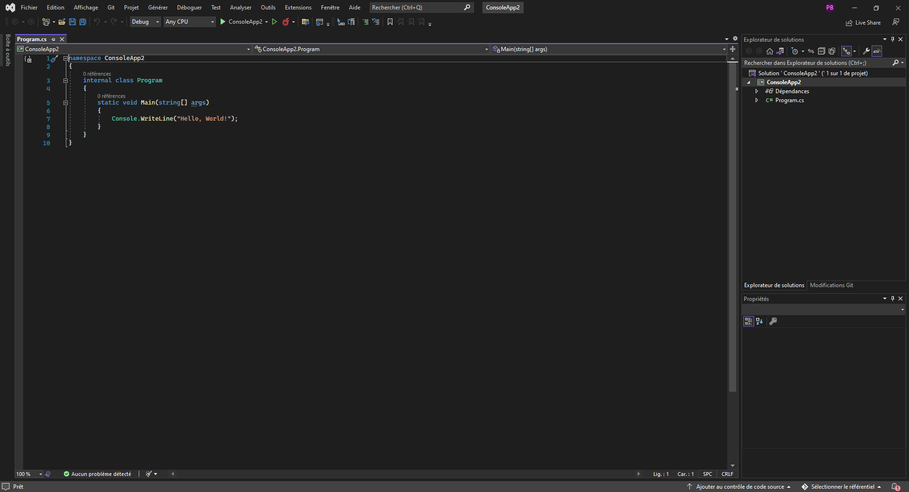

Cliquez sur le bouton nommé "**ConsoleApp2**" ou un nom similaire.

Après quelques instants, une fenêtre ressemblant à celle ci devrait apparaître. Le texte "**Hello World!**" devrait apparaître au début de la fenêtre.

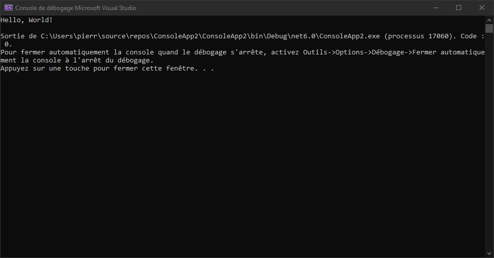

Si l'une des étapes suivantes n'a pas fonctionnée pour vous ou que vous n'arrivez pas au même résultat final, assurez vous de contacter votre enseignant rapidement pour qu'il puisse vous aider.
