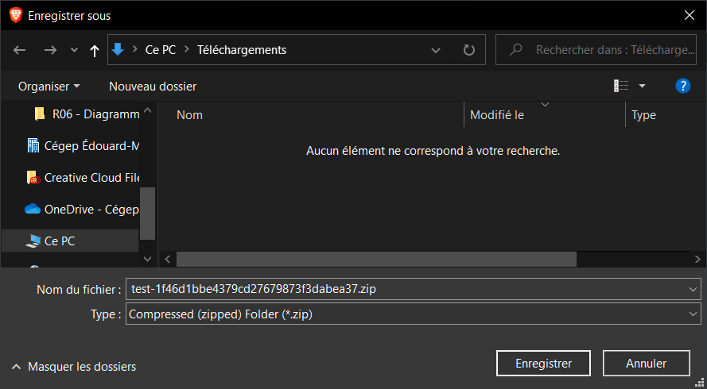

# 7zip

7-Zip permet entre autre de compresser un **répertoire** (dossier) en un fichier que l'on appelle **archive** ainsi que de décompresser une **archive** vers un **répertoire**.

## Télécharger l'installateur

Naviguez sur la page des téléchargements de [7-Zip](https://www.7-zip.org/download.html) et cliquez sur le premier bouton "**Download**" qui est vis à vis **Type** `.exe` et **System** `64-bit Windows x64`. Enregistrez le fichier à un endroit familier sur votre ordinateur.

## Installer 7-Zip

Double cliquez sur l'installateur téléchargé à la précédente étape. Acceptez de donner les permissions qui vous sont demandées.

Cliquez sur le bouton "**Install**".

Une fois l'installation complétée. Cliquez sur le bouton "**Close**".

## Vérification

Téléchargez le fichier **[suivant](@site/static/file/test.zip)**.

- Effectuez un clic droit sur le fichier téléchargé.
- Vous devriez appercevoir un option nommée "**7-Zip**".
- Cliquez dessus.
- Cliquez sur l'option "**Extraire vers "test-[...]"**".

Un nouveau répertoire nommé "**test-[...]**" devrait être apparu à côté du fichier téléchargé.

Ouvrez ce répertoire, puis ouvrez le fichier nommé "**Fichier test.txt**". Vous devriez voir le message "**Votre installation de 7zip est fonctionnelle. Félicitation!**"

Si l'une des étapes suivantes n'a pas fonctionnée pour vous ou que vous n'arrivez pas au même résultat final, assurez vous de contacter votre enseignant rapidement pour qu'il puisse vous aider.
