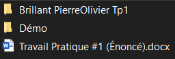
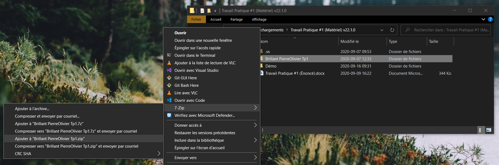
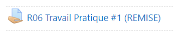
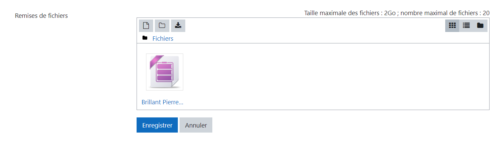
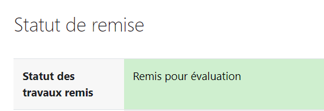

# Remettre ses exercices ou ses travaux pratiques

## Renommer dans Visual Studio

Si ce n'est pas déjà fait, avant de fermer Visual Studio, assurez vous d'avoir renommé la variable `APP_INFO` avec votre nom et prénom.

```cs
public const string APP_INFO = " (Matériel)";
```

devient

```cs
public const string APP_INFO = " (Nom Prenom)";
```

:::tip Truc

Si vous ne trouvez pas la variable, vous pouvez ouvrir la recherche avec `Ctrl+f` et chercher `APP_INFO`.

:::

:::caution Attention!

Vous pourriez éventuellement perdre des points pour les travaux pratiques si ce n'est pas effectué.

:::

## Renommer les fichiers

- Fermez Visual Studio.
- Si ce n'est pas déjà fait, renommez le répertoire qui se nomme "**Nom prenom [...] (Départ)**" pour votre nom et votre prénom et en retirant le "**(Départ)**".



:::caution Attention!

Vous pourriez éventuellement perdre des points pour les travaux pratiques si ce n'est pas effectué.

:::

## Compresser le répertoire

Compressez le répertoire nommé "**Nom prenom [...]**" à l'aide de 7-zip.



## Effectuer une remise

Sur Moodle, naviguez vers la page de remise du travail que vous souhaitez remettre.



- Glissez votre archive dans la zone de remise.
- Cliquez sur le bouton "**Enregistrer**".



Assurez vous de voir la confirmation de votre remise. Vous devriez aussi recevoir un courriel vous confirmant que votre travail a bien été remis.


