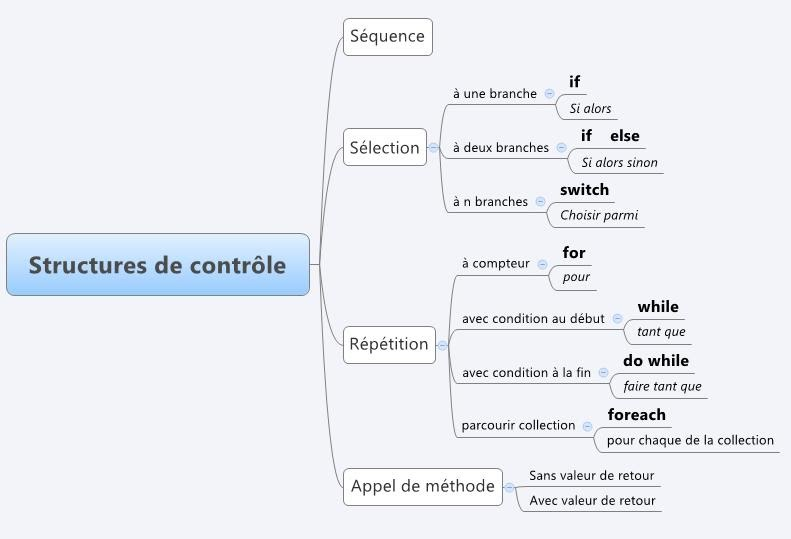

# Structures de contrôle

```mdx-code-block
import DocCardList from '@theme/DocCardList';
```

À priori, dans un programme, les instructions sont exécutées en **séquence**, c'est-à-dire dans l'ordre où elles apparaissent. Cependant, il est possible d'effectuer ou non des instructions selon une condition ou répéter des instructions.

Le langage C# est un langage de programmation structuré offrant des structures de contrôle : une **sélection** (alternative), une **répétition** (boucle) et un **appel de méthode**.

La **sélection** permet d'exécuter ou non un bloc d'instructions selon une condition qui est vraie ou fausse.

La **répétition** permet de répéter un bloc d'instructions un certain nombre de fois.

L'**appel de méthode** permet de diriger le contrôle de l'exécution vers une autre section du code. Une fois la méthode terminée, le contrôle revient à l'instruction qui suit l'appel de cette méthode.



<DocCardList />
