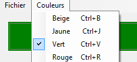

# Menu

Un composant **MenuStrip** est un menu appelé à contenir une collection d'items qui sont des sous-menus de type **ToolStripMenuItem**.

Le menu principal `mnuPrincipal` suivant contient deux sous-menus: `mnuFichier` et `mnuCouleurs`.

- le sous-menu Fichier contient 1 item : `mnuFichierQuitter`.
- le sous-menu Couleurs contient 4 items : `mnuCouleursBeige`, `mnuCouleursJaune`, `mnuCouleursVert` et `mnuCouleursRouge`.



| Propriété | Type | Description |
| :-------: | :--: | ----------- |
|  <br/> (Name) | | Le nom utilisé dans le code pour identifier l’objet. Préfixe : `mnu` Exemples: `mnuPrincipal`, `mnuFichier`, `mnuFichierQuitter` |
|  <br/> Text | `string` | Le texte apparaissant dans la barre des menus. Exemple : "Beige". |
|  <br/> Shortcutkey | | La touche de raccourci clavier associée au menu. Exemple: Ctrl + B |
|  <br/> Checked | `bool` | Obtient ou définit une valeur indiquant si le menu est coché ou non. |

| Événement | Description |
| :-------: | ----------- |
|  <br/> Click | Se produit lorsque l'utilisateur clique sur le menu. |

## Exemple #1 : Décocher la collection des items du menu Couleurs

```cs
foreach (ToolStripMenuItem itemCourant in mnuCouleurs.DropDownItems)
{
    itemCourant.Checked = false;
}
```
