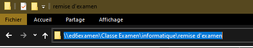

# Remise d'examens

- Fermez tout les projets Visual Studio ouverts.
- Renommez le dossier "Nom prénom" (si ce n'est pas déjà fait).
- Compressez le répertoire "Nom prénom" afin d'obtenir l'archive "Nom prénom.zip".
- Ouvrez l'explorateur Windows et copiez le chemin suivant dans la barre de recherche `\\ed6examen\Classe Examen\informatique\remise d'examen`.
- Localisez et ouvrez le répertoire ayant le nom de votre enseignant.
- Déposez votre archive "Nom prénom.zip" dans le répertoire de votre enseignant.

:::tip Astuce pour compresser

- Clic droit sur le répertoire
- 7-Zip
- Ajouter à "Nom prénom.zip"

:::

:::tip Astuce pour accéder au dossier de la remise

Appuez sur `Enter` pour accéder au chemin.

:::

:::caution Attention

Validez toujours avec votre enseignant qu'il ou elle a reçu votre examen avant de fermer votre poste. Si votre examen est perdu vous serez tenu comme responsable et risquez d'obtenir la note de 0.

:::
